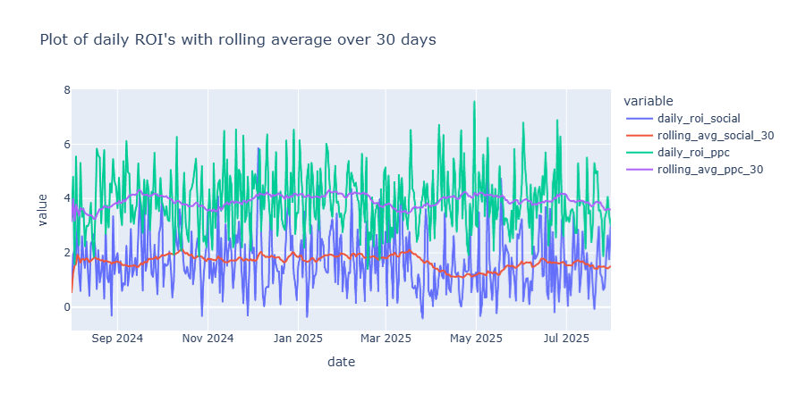

# Project: Marketing Channel Performance Analysis

## Objective
Given the four datasets, the objective is to analyze the effectiveness of three different marketing campaigns to inform future budget allocation.

## Data Ingestion & Integration (ETL)
For this step, the four datasets were loaded using Pandas. These datasets had column names in common, so the first step was to rename them: 'clicks' appeared both in the 'email_campaigns' dataset and in the 'social_media_ads' dataset, so they were renamed to 'clicks_email' and 'clicks_social', respectively. The column 'spend', which appeared on the datasets 'ppc_spend' and 'social_media_ads', was renamed to 'spend_ppc' and 'spend_social', respectively. The column 'impressions', from the 'social_media_ads' dataset, was renamed to 'impressions_social' to make clear its provenance.

Finally, the 'clicks_email' and 'clicks_social' columns were merged into one 'clicks' column, and the same was done to 'spend_ppc' and 'spend_social'. The date column was converted to datetime, and the final dataset was saved as 'aggregated_data.csv'. The whole process is done by 'src/process_data.py'.

## KPI Calculation

For this step, all calculations were performed within the Jupyter Notebook 'notebooks/marketing.ipynb'.

1. **Total Spend:**

    The total spend was calculated for the PPC and Social Media channels, which were the ones containing a 'spend' column. To calculate the total spend, we filtered the data per channel and dropped duplicates within the subset ['date', 'spend'] (since each date appears multiple times with the same 'spend' entry), and the resulting 'spend' column was summed. 

* Total spent on the PPC campaign: $107,357.76.
* Total spent on the Social Media campaign: $53,383.98.

2. **Total Clicks and Total Conversions:**

    Information on clicks was only available for the Email and Social Media campaigns. Similarly to the process for calculating the total spend, we first filtered the data by channel and dropped duplicates from the subgroup ['date', 'clicks']. The column 'clicks' was then summed.

* Total clicks on the Email campaign: 41,540.
* Total clicks on the Social Media campaign: 79,505.

    Since each entry on the 'website_conversions' dataframe represents a unique conversion, the total number of conversions per channel was obtained by isolating the channel and summing the number of rows.

* Total conversions on the Email campaign: 3,359.
* Total conversions on the PPC campaign: 5,211.
* Total conversions on the Social Media campaign: 1,803.

3. **Total Revenue:**

    Since each row on the dataframe corresponds to a unique conversion with a corresponding revenue, to obtain the total revenue per channel we isolated the channel and summed all rows in the 'revenue' column.

* Total revenue on the Email campaign: $443,545.61.
* Total revenue on the PPC campaign: $529,386.11.
* Total revenue on the Social Media campaign: $142,647.07.

4. **Click-Through Rate (CTR) for Social Media:**

    The Click-Through-Rate (CTR) for a social media campaign is defined as the ratio between the total number of clicks and the total number of impressions (the number of times the ad appeared on an user's feed), in percentage. To calculate this, we first filtered the data to the 'Social Media' channel and then dropped duplicates within the subgroup ['date', 'clicks', 'impressions_social']. Next, we divided the sum of all rows in the column 'clicks' by the sum of all rows in the column 'impressions_social', multiplied by 100.

* CTR for the Social Media campaign: 1.50%.

5. **Conversion Rate (CR):**

    The Conversion Rate (CR) is defined as the ratio between the total number of conversions and the total number of clicks, in percentage.

* CR for the Email campaign: 8.09%.
* CR for the Social Media campaign: 2.27%.

6. **Cost Per Click (CPC):**

    The Cost Per Click (CPC) is defined as the ratio between the total amount spent and the total number of clicks. Since only the Social Media channel has both data points available, the CPC was only calculated for this channel. The calculation involves filtering the data to the Social Media channel, dropping duplicates within the ['date', 'spend', 'clicks'] subgroup, and finally dividing the sum of all rows of 'spend' by the sum of all rows of 'clicks'.

* CPC for the Social Media campaign: $0.67.

7. **Cost Per Acquisition (CPA) or Cost Per Conversion:**

    The Cost Per Acquisition (CPA) is defined as the ratio between the total amount spent and the total number of conversions. This metric was calculated for the PPC and Social Media campaigns.

* CPA for the PPC campaign: $20.60.
* CPA for the Social Media campaign: $29.61.

8. **Return On Investment (ROI) or Return On Ad Spend (ROAS):**

    The Return On Ad Spend (ROAS) is defined as the return divided by the amount spent. Data on expenditure is only available for the Social Media and PPC campaigns. To calculate the ROAS, we first filtered the data by channel, groupped the data by 'date' and summed the 'revenue' column for each date, which generated a series of daily revenues with dates as index. We then generated a series containing daily expenditures by dropping duplicates within the subgroup ['date', 'spend'], setting 'date' as the index and selecting the column 'spend'. These two series were combined into a dataframe, and we generated a column containing daily ROAS entries by dividing the column 'daily_revenue' by the column 'daily_spend'. This dataframe can be inspected in the notebook.

    In order to obtain a single ROAS value per campaign, before taking the ratio of 'daily_revenue' and 'daily_spend', we summed all rows of each column.

* ROAS for the Social Media campaign: 2.67.
* ROAS for the PPC campaign: 4.93.

    The Return On Investment (ROI) is defined as the ratio between the net profit (total revenue minus the amount spent) and the amount spent, or simply ROAS minus 1.

* ROI for the Social Media campaign: 1.67.
** ROI for the PPC campaign: 3.93.

## Analysis and Insights

The calculations for this part were performed on the same Jupyter Notebook from the previous section.

1. **Which channel has the highest ROI?**

    From the previous section, we know that the ROI for PPC is the highest at 3.93.

2. **Which channels are the most and least expensive for acquiring a customer (CPA)?**

    The most expensive channel for acquiring a customer is Social Media ($29.61 CPA), which leaves PPC as the least expensive ($20.60 CPA).

3. **Which channel is most effective at converting clicks into sales?**

    The most effective channel at converting clicks into sales is the Email campaign with a Conversion Rate of 8.09%.

4. **Is there any observable trend in performance over time for any of the channels?**

    In order to quantify performance, we must use a metric that captures both cost and revenue. The best metric for this is the ROI, or its close derivative, ROAS. While other metrics, like CPA and Conversion Rate, measure efficiency at intermediate points of the process, ROI compares the campaign's entry (spend) and exit (revenue), thus measuring the profitability of the channel.

    For this task, a figure was generated showing a plot of daily ROI values for the channels Social Media, in blue, and PPC, in green. These two signals have very high volatility and are thus hard to analyse; thus, a "trend" line was created, which consists of a rolling average over a 30-day window. The trend line is shown in red for Social Media and purple for PPC.

    

    Observing the trend lines, there doesn't seem to be an upward or downward trend, and although there is some variation during the year, the ROI doesn't seem to deviate far from the trend line. On the PPC campaign, we can note that there are some throughs in the data aorund the months of November/December and March/April. The ROI for the Social Media campaign seems more stable, altough there's a big fall around the months of April/May. These "trends" could be just noise, or could indicate seasonal factors, such as car tire changing period, or increased social media consuption during winter months. 

## Summary & Budget Recommendations

The analysis of marketing channel performance across Pay-Per-Click (PPC), Email Marketing, and Social Media reveals disparities in profitability and efficiency. Based on an evaluation of the key metrics, we recommend shifting budget focus primarily to the PPC channel for the next quarter.

The total KPI summary shows that PPC is the superior channel. PPC delivers a Total ROI of 3.93 (a $3.93 profit for every dollar spent) and acquires customers at the lowest cost, with a CPA of $20.60. In contrast, Social Media provides a lower Total ROI of 1.67 and is the most expensive channel for acquisition, with a CPA of $29.61. We lack the spend data to calculate ROI and CPA for Email, but its Conversion Rate of 8.09% is the highest of all channels, indicating that the traffic it drives is of the highest quality.

The trend analysis, which used a 30-day rolling average on the daily ROI values, suggests that overall channel performance is stable. There is no evidence of a rapid, sustained upward or downward trend across the board. While notable troughs in PPC ROI were observed around the late first quarter and a significant drop occurred in Social Media in April/May, performance generally recovered and stabilized. These fluctuations could be linked to seasonal factors, but the primary conclusion is that the channels are currently operating at a consistent performance level.

Based on these findings, we provide three data-driven recommendations. First, we must prioritize investment in PPC. Since it is the most profitable and cost-efficient channel, a significant portion of any new or reallocated marketing budget should be directed to PPC campaigns to maximize profit. Second, we recommend maintaining and further investigating the Email Campaign. Given its excellent Conversion Rate, the current email frequency should be sustained, and the team should track all associated costs to calculate its true ROI and CPA retrospectively. Third, we suggest optimizing the Social Media budget. Due to its high acquisition cost (CPA of $29.61) and lower ROI, funds should be reallocated from lower-performing Social Media ad sets to the high-performing PPC channel.